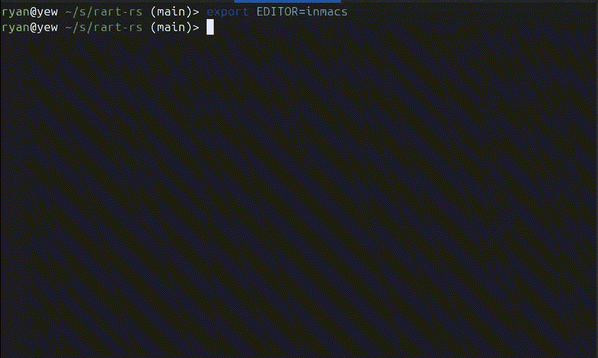
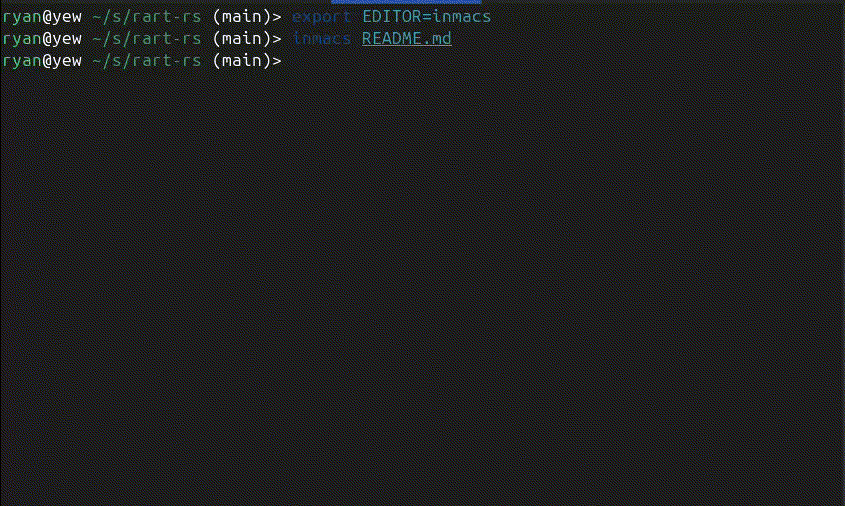

# innards

Small inline terminal tools for jumping around source code and editing files without
clearing the shell above them.

On account of agents I spend most of my time in a terminal window these days,
and often also remote over SSH, and I missed some of the conveniences of an IDE
but wanted something quick and nimble that didn't break flow.

These little utilities let you drop in and out of navigation and editing and
viewing files but what you were working on visible.

Quick, and get out of your way.

## Demos

`inmacs` as an inline editor:

<p align="center">
  
</p>

`navsplat` as an inline symbol picker:

<p align="center">
  
</p>

## Binaries

- `navsplat`: rust-analyzer-backed Rust workspace symbol picker.
- `inmacs`: inline editor with Emacs-like navigation and editing keys.
- `inpage`: read-only inline pager with the same movement/search surface as
  `inmacs`.

All three use ratatui with an inline terminal viewport, so they open below the
current prompt instead of taking over the whole screen.

## Build

```sh
cargo build --release --bins
```

The binaries will be under `target/release/`.

Build a Debian package with `cargo-deb`:

```sh
cargo install cargo-deb
cargo deb
```

The `.deb` will be written under `target/debian/`.

## Install

Install from a local checkout:

```sh
cargo install --path .
```

Install directly from git:

```sh
cargo install --git https://github.com/rdaum/innards.git
```

`cargo install` places the binaries in Cargo's bin directory, usually
`~/.cargo/bin`. Make sure that directory is on `PATH`.

## Requirements

`navsplat` starts `rust-analyzer` and talks to it over LSP, so `rust-analyzer`
must be on `PATH`.

`navsplat` opens selections with `$VISUAL`, then `$EDITOR`, then `vi` if neither
environment variable is set. It invokes the editor as:

```sh
$EDITOR +LINE FILE
```

Clipboard copy tries `wl-copy`, `xclip`, `xsel`, `pbcopy`, then OSC 52.

## navsplat

Run the interactive picker from inside a Rust project:

```sh
navsplat
```

Start with an initial query:

```sh
navsplat pick '#main'
```

Use a specific workspace root or editor:

```sh
navsplat --root ~/src/my-crate --editor 'vim' pick HashMap
```

Print matches without opening the TUI:

```sh
navsplat symbols '#main'
```

Options:

```text
--root PATH       Workspace root. Defaults to the nearest Cargo.toml or .git.
--editor CMD      Editor command. Defaults to $VISUAL, $EDITOR, then vi.
--height ROWS     Inline picker height. Defaults to 20.
```

Picker keys:

```text
Enter             Open the selected symbol, or promote a selected side-pane hit
Esc, Ctrl-C       Quit
q                 Quit when the search input is empty
Up/Down           Move selection
Ctrl-P/Ctrl-N     Move selection
PageUp/PageDown   Move by larger steps
Shift-Up/Down     Scroll the preview pane
Tab               Switch focus between symbols and the side pane
Alt-R             Show references
Alt-C             Show callers
Alt-E             Show callees
Alt-S             Return the right pane to source preview mode
Backspace         Pop back after promoting a side-pane hit
Alt-Y             Copy the selected location
```

The preview is centered around the selected symbol when possible. References,
callers, and callees are loaded lazily for the current selection.

## inmacs

Open a file in the inline editor:

```sh
inmacs src/lib.rs
```

Open at a line:

```sh
inmacs +120 src/lib.rs
inmacs --line 120 src/lib.rs
```

Set the inline viewport height:

```sh
inmacs --height 18 src/lib.rs
```

Core keys:

```text
Ctrl-X Ctrl-S     Save
Ctrl-X Ctrl-C     Quit
Ctrl-X 1          Expand to the full terminal height
Ctrl-X 0          Restore the previous inline height
Ctrl-S            Incremental search forward
Ctrl-R            Incremental search backward
Ctrl-S/Ctrl-R     Repeat search while searching
Enter             Finish search while searching
Esc, Ctrl-G       Cancel search while searching
Ctrl-G            Cancel active mark outside search
Ctrl-A/Ctrl-E     Start/end of line
Ctrl-B/Ctrl-F     Character left/right
Alt-B/Alt-F       Word left/right
Alt-Q             Fill/reflow the current paragraph to 80 columns
Ctrl-Left/Right   Word left/right
Ctrl-P/Ctrl-N     Line up/down
Alt-V/Ctrl-V      Page up/down
PageUp/PageDown   Page up/down
Alt-Up/Down       Shrink/grow the inline viewport
Ctrl-Space        Set or clear mark
Ctrl-W            Kill active region
Alt-W             Copy active region
Ctrl-Y            Yank
Ctrl-K            Kill to end of line
Ctrl-D/Delete     Delete character
Backspace         Delete backward
Ctrl-/ Ctrl-_     Undo
Ctrl-7            Undo
Ctrl-?            Redo, where the terminal reports it distinctly
```

`inmacs` uses `ropey` internally for text storage and `syntect` for syntax
highlighting.

## inpage

Open a read-only inline pager:

```sh
inpage src/lib.rs
inpage +120 src/lib.rs
```

`inpage` accepts the same `--height`, `--line`, and `+LINE` arguments as
`inmacs`. Editing keys are disabled, but movement and search keys are shared.

Additional pager quit keys:

```text
Esc
q
```

## Configuration

Innards reads TOML configuration from:

```text
$XDG_CONFIG_HOME/innards/config.toml
```

If `XDG_CONFIG_HOME` is not set, it falls back to:

```text
~/.config/innards/config.toml
```

Example:

```toml
[inmacs]
fill_column = 100

[keybindings.inline]
fill_paragraph = "alt-q"
fullscreen = "ctrl-x 1"
restore_inline = "ctrl-x 0"
save = "ctrl-x ctrl-s"
quit = "ctrl-x ctrl-c"
search_forward = "ctrl-s"
search_reverse = "ctrl-r"
page_up = ["alt-v", "pageup"]
page_down = ["ctrl-v", "pagedown"]

[keybindings.navsplat]
open = "enter"
quit = ["esc", "ctrl-c"]
toggle_focus = "tab"
references = "alt-r"
callers = "alt-c"
callees = "alt-e"
source = "alt-s"
copy = "alt-y"
```

Configured action bindings replace the built-in bindings for that action.
Unmentioned actions keep their defaults. Key names are case-insensitive and can
use modifiers such as `ctrl-`, `alt-`, and `shift-`. Multi-key sequences are
written with spaces, for example `ctrl-x ctrl-s`.

Inline actions shared by `inmacs` and `inpage`:

```text
quit, save, search_forward, search_reverse, cancel_search, finish_search,
cancel_mark, set_mark, undo, redo, line_start, line_end, word_left,
word_right, char_left, char_right, line_up, line_down, page_up, page_down,
copy_region, kill_region, kill_to_eol, yank, delete_char, backspace,
insert_newline, insert_tab, shrink_height, grow_height, fullscreen,
restore_inline, fill_paragraph, quit_view
```

`navsplat` actions:

```text
quit, quit_if_empty, open, pop, toggle_focus, references, callers, callees,
source, copy, select_prev, select_next, preview_up, preview_down, page_up,
page_down, delete_next_char
```

## Development

Useful checks:

```sh
cargo fmt
cargo check --bins
cargo test --lib
cargo build --bins
```

GitHub Actions runs formatting, Clippy, tests, and release binary builds on
pushes to `main` and pull requests. Pushing a `v*` tag builds the Debian package
and uploads it to the corresponding GitHub Release; the Debian package workflow
can also be run manually from the Actions tab.

## License

`navsplat` is licensed under GPL-3.0-only. See `LICENSE`.
